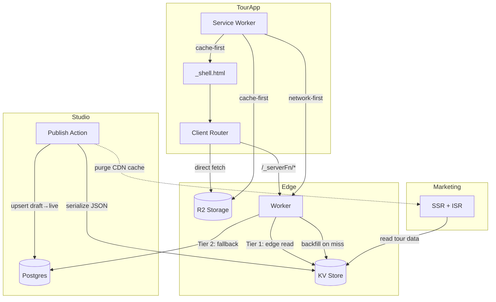

> How the visitor-facing tour app delivers content offline-first from the edge.

## System Overview

ValGuide's visitor-facing architecture is built around one core insight: **museum visitors arrive via QR code, not search engines**. This means SEO is irrelevant for the tour app, and the entire architecture optimizes for fast first load, instant navigation, and full offline support.

The system has three main surfaces and a shared data layer:



## Tour App (`app.valguide.com`)

### Runtime Model

The tour app runs as a **full SPA** — TanStack Start with SPA mode enabled. At build time, the root route is prerendered into a static `_shell.html` file. At runtime, there is no server-side rendering. The Cloudflare Worker handles only:

1. **Static asset serving** — JS, CSS, fonts, images
2. **Server functions** (`/_serverFn/*`) — data fetching, auth
3. **Shell fallback** — all other requests rewrite to `_shell.html`

```
Request flow:
  /org/tour          →  _shell.html (static)  →  client renders tour page
  /_serverFn/getTour →  Worker executes        →  reads KV → returns JSON
  /assets/main.js    →  static file            →  served directly
```

### Why SPA, Not SSR

| Concern | SSR | SPA |
|---------|-----|-----|
| SEO | Server-renders HTML for crawlers | No HTML for crawlers — irrelevant for QR entry |
| Offline | Cannot cache server-rendered responses easily | Static shell is perfectly cacheable by service worker |
| Worker compute | Every page load runs a render pass | Worker only handles server functions |
| Hydration | Must match server/client output | No hydration — client renders from scratch |
| Complexity | SSR/SPA boundary concerns | Single mental model |

### Shell Generation

The build step (`vite build`) prerenders the root route to produce `_shell.html`. During this prerender:

- `getCurrentUserFn` → returns `null` (no authenticated user at build time)
- `resolveLocaleFn` → returns `'en'` (default locale, no cookies)
- `getThemeFn` → returns `'system'` (default theme, no cookies)

This data is dehydrated into the shell HTML via `setupRouterSsrQueryIntegration`. On the client, React Query rehydrates this data and then takes over — the user query returns `null`, locale/theme come from the visitor's cookies on subsequent server function calls.

The shell contains:
- Full HTML document with `<head>` (meta tags, stylesheets, theme script)
- The `defaultPendingComponent` (a centered spinner) where route content will render
- Dehydrated React Query cache with root-level data
- JS entry point that boots the router and renders the matched route

### Key Files

| File | Purpose |
|------|---------|
| `apps/app/vite.config.ts` | `spa: { enabled: true }` in `tanstackStart()` config |
| `apps/app/src/router.tsx` | `defaultPendingComponent: AppLoadingSkeleton` |
| `apps/app/src/routes/__root.tsx` | `shellComponent: RootDocument`, root `beforeLoad` |
| `apps/app/src/components/app-loading-skeleton.tsx` | Loading state shown in shell |

## Data Layer

### Three-Tier Read Path

Tour data follows a three-tier read path, from fastest to slowest:

```
┌─────────────────────────────────────────────────────────┐
│  Tier 0: Service Worker Cache (client)                  │
│  Local — instant — works offline                        │
│  Caches: _shell.html, stop JSON, audio files            │
├─────────────────────────────────────────────────────────┤
│  Tier 1: Cloudflare KV (edge)                           │
│  Edge — <10ms — globally distributed                    │
│  Denormalized JSON blobs, keyed by org/tour/locale      │
├─────────────────────────────────────────────────────────┤
│  Tier 2: Postgres (origin)                              │
│  Origin — 50-200ms — source of truth                    │
│  Normalized relational data in Neon Postgres              │
├─────────────────────────────────────────────────────────┤
│  Tier 3: Error State                                    │
│  Graceful error UI — "tour not available offline"        │
└─────────────────────────────────────────────────────────┘
```

**Read path logic (in the Cloudflare Worker server function):**

1. Read from KV by key `tour:{tourNanoId}:{locale}`
2. If KV miss → query Postgres, serve the response, backfill KV asynchronously
3. If Postgres also fails → return error

The service worker adds a client-side cache layer (Tier 0) that enables full offline support.

### Cloudflare KV — Edge Cache

KV stores denormalized, locale-scoped JSON blobs. Each tour is a **single KV entry** containing the full tour data plus all stops with their content and assets, keyed by nanoId (stable, immutable — not slugs or org IDs which can change):

```
Key structure:
  tour:{tourNanoId}:{locale}           →  full tour (metadata + all stops + assets + theme)
  org-slug:{orgSlug}                   →  org nanoId + primary slug
  tour-slug:{orgSlug}:{tourSlug}       →  tour nanoId + primary slug + org primary slug
```

One KV read returns everything needed to render both the tour page and all stop pages. Stops are embedded in the tour blob rather than stored separately because:
- The stop page finds its stop from `context.tour.stops` — no independent fetch
- `toPlayerStops()` needs full `StopWithAssets[]` (translations + assets) for all stops
- One KV read per page load vs. 1 + N reads (tour + each stop)
- Typical blob size: 5–20 KB, well within KV's 25 MB value limit

**Why KV, not just CDN caching?**
- KV entries are explicitly written on publish — no cache invalidation complexity
- KV is globally distributed with <10ms reads at the edge
- Studio can write directly to KV — updates are instant, not waiting for CDN TTL expiry
- KV entries are versioned per publish — no stale data concerns

### Cloudflare R2 — Media Storage

Studio uploads audio, images, and video directly to R2 during content editing. Assets are stored at stable paths:

```
R2 path structure:
  assets/{assetNanoId}/{fileNanoId}.{ext}     (general assets)
  orgs/{orgNanoId}/logos/{fileNanoId}.{ext}    (org logos)
  users/{userNanoId}/avatars/{fileNanoId}.{ext} (user avatars)
```

KV blobs include asset `storagePath` fields. The visitor app resolves display URLs at render time via `getAssetDisplayUrl()`: images route through ImageKit CDN (R2 as origin) for on-the-fly transforms, while audio/video fetches directly from R2 via the public bucket URL (`assets.valguide.com` in prod, `assets.valguide.dev` in dev). No Worker compute needed for media serving.

### Postgres — Source of Truth

Postgres (via Neon) remains the authoritative data store. Studio reads and writes here. The draft/live table pairs described in the [Status Model](../content-model/status-model.md) and [Publishing](../content-model/publishing.md) docs define what data is publishable.

KV and R2 are derived caches — they can always be rebuilt from Postgres.

## Content Pipeline

### Publish Flow

When a curator clicks **Publish** in Studio:

```
Studio "Publish Tour" action
  │
  ├─ 1. Postgres transaction
  │     Upsert draft → live tables for the active locale
  │     (tour locale, stop locales, structure, settings, assets)
  │
  ├─ 2. Serialize to KV (DB read inline, KV write via waitUntil)
  │     For the published locale:
  │       ├─ Read back full published tour from Postgres (inline, before response)
  │       ├─ Build single tour JSON blob (metadata, all stops with content, assets, theme)
  │       ├─ Write to KV via waitUntil: tour:{tourNanoId}:{locale}
  │       └─ Write slug KV entries (org-slug + tour-slug) for warm slug resolution
  │
  └─ 3. Purge CDN cache (future — for marketing site)
        Invalidate cached pages for the published tour
```

Media is already in R2 — Studio uploads directly to R2 during content editing, not during publish.

**Key property:** The Postgres transaction is synchronous. DB reads for KV serialization happen inline (while the request-scoped DB connection is still alive). KV writes then happen via `waitUntil` (non-blocking). If KV writes fail, data is still in Postgres and will be served via the Tier 2 fallback path.

> **⚠️ `waitUntil` constraint:** `runWithRequestDb` closes the DB connection when the handler returns. Code inside `waitUntil` runs *after* the response — so it must **never access the DB**. Always do DB reads inline and pass data to the deferred task.

### KV Backfill (Cache Miss)

If a KV entry is missing (e.g., after a KV wipe or for legacy data):

1. Worker server function receives a request for tour data
2. KV lookup returns `null`
3. Server function queries Postgres directly, builds the response
4. Response is served to the client
5. Asynchronously (via `waitUntil`), the response is written to KV for future requests

This ensures the system is self-healing — even if KV is empty, tours still work (with slightly higher latency on the first request).

## Offline Strategy

### Service Worker Architecture

The service worker enables full offline tour experiences. After a visitor opens a tour on WiFi, the entire tour is available underground, in airplane mode, or in a dead zone.

```
Service Worker Cache Strategy:

  _shell.html              →  Cache-first (static, changes only on deploy)
  /assets/*.js, *.css      →  Cache-first (hashed filenames, immutable)
  /_serverFn/getTour       →  Network-first, fall back to cache
  KV tour/stop JSON        →  Network-first, fall back to cache
  R2 audio/images/video    →  Cache-first (immutable asset URLs)
```

### Prefetch Strategy

When a visitor opens a tour page:

1. Service worker caches `_shell.html` + all static assets (JS, CSS, fonts)
2. Tour data blob (including all stops) is fetched and cached — a single KV read
3. Audio files for all stops in the current locale are prefetched in the background

**Result:** The entire tour — every stop, every audio file — is available offline after the initial load.

### Offline Bundle Per Locale

Each locale has a self-contained offline bundle:

```
Cached per locale:
  _shell.html                                              (shared)
  /assets/*.js, *.css                                      (shared)
  tour:{tourNanoId}:{locale}                               (locale-specific, from KV — includes all stops)
  assets/{assetNanoId}/{fileNanoId}.{ext}                  (from R2, referenced in KV blob)
```

Switching locale while offline is not supported — the visitor sees only the locale they opened the tour in. This is acceptable because museum visitors typically use one language throughout their visit.

## Marketing Site (Future)

> **Not yet implemented.** Included here for architectural context.

The marketing site (`museum.com/tours/...`) serves a different purpose than the tour app: it's the public-facing, SEO-optimized discovery surface.

| Aspect | Tour App | Marketing Site |
|--------|----------|----------------|
| Entry point | QR code scan | Google, social, direct link |
| Rendering | Full SPA (no SSR) | SSR + ISR |
| SEO | Irrelevant | Critical |
| Offline | Full offline support | Not needed |
| URL structure | `app.valguide.com/{org}/{tour}` | `museum.com/{locale}/tours/{tour}` |
| Data source | KV → Postgres fallback | Same KV data |

**ISR (Incremental Static Regeneration):**
- Pages are server-rendered and cached at the CDN edge
- Cache headers control TTL
- Publish action purges the CDN cache for updated pages
- Subsequent requests get a fresh server render, which is then cached

The marketing site reads from the same KV data as the tour app. This means:
- One publish action updates both surfaces
- No data duplication or sync concerns
- Marketing site can render Open Graph meta tags from KV data for social sharing

## Infrastructure Summary

```
┌─────────────────────────────────────────────────────────────────┐
│                     Cloudflare Edge Network                     │
│                                                                 │
│  ┌─────────────┐  ┌─────────────┐  ┌────────────────────────┐  │
│  │ Workers      │  │ KV          │  │ R2                     │  │
│  │              │  │             │  │                        │  │
│  │ Tour app     │  │ Tour blobs  │  │ Audio files            │  │
│  │ server fns   │  │ (full tour  │  │ Images                 │  │
│  │              │  │ + all stops │  │ Video                  │  │
│  │ Marketing    │  │ per locale) │  │ Per org + locale       │  │
│  │ site SSR     │  │             │  │                        │  │
│  └─────────────┘  └─────────────┘  └────────────────────────┘  │
│                                                                 │
└──────────────────────────┬──────────────────────────────────────┘
                           │
                    ┌──────▼──────┐
                    │    Neon     │
                    │  Postgres   │
                    │  (origin)   │
                    └─────────────┘
```

| Service | Role | Used by |
|---------|------|---------|
| **Cloudflare Workers** | Runs server functions, serves static assets, shell fallback | Tour app, marketing site, Studio API |
| **Cloudflare KV** | Denormalized edge cache — one blob per tour+locale with all stops embedded | Tour app (read), Studio (write on publish) |
| **Cloudflare R2** | Media storage (audio, images, video) | Tour app (read), Studio (write on upload) |
| **Neon Postgres** | Source of truth for all content | Studio (read/write), Worker fallback (read) |
| **Service Worker** | Client-side cache for offline support | Tour app only |

## Related Documentation

- [Publishing in ValGuide](../content-model/publishing.md) — what gets published and when
- [Status Model](../content-model/status-model.md) — draft/live table pairs, change detection
- [Slug Architecture](./slugs.md) — URL structure and redirect handling
- [Domains & DNS](../../operations/domains-and-dns.md) — subdomain layout and routing
- [Localisation](../content-model/localisation.md) — document-level locale model
